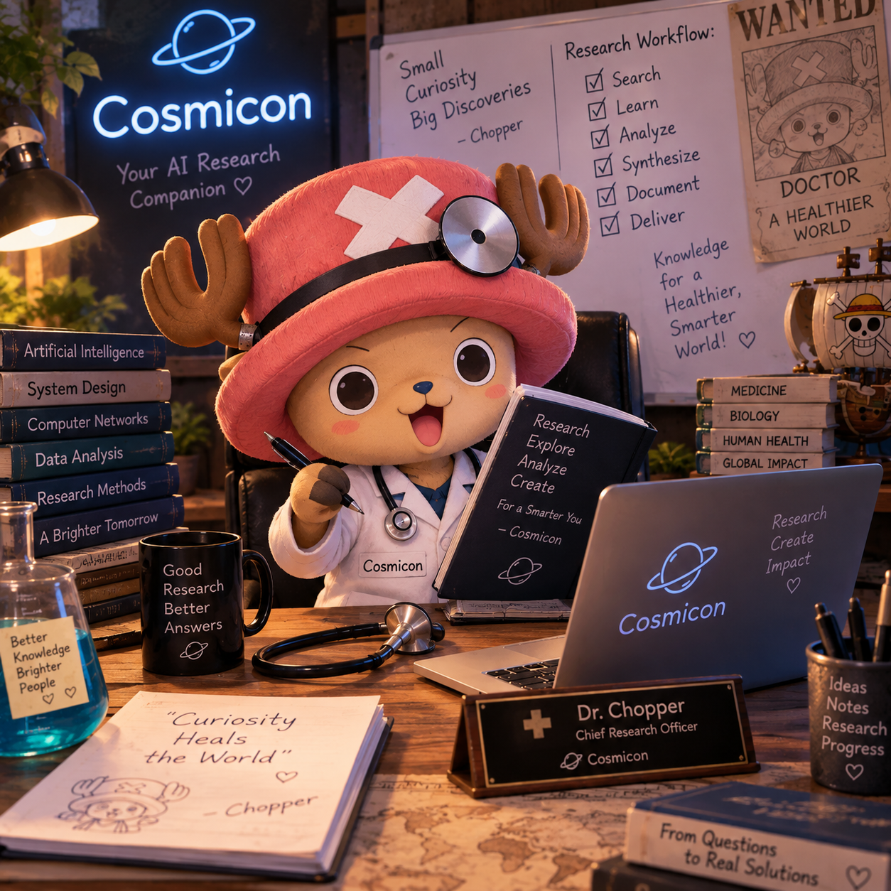

  

If u want to run this agent create a omniroute extension in ur desktop and generate an api key against and the tools.py has all the tools requried for researching a specific topic currently the data from each website is limited to 5000 lines
if u want to icnrease urt context size setup a faiss database for it
currently it usess ReAct loop insteaad of langgraph implementation 
langgraph implementation wud be done later 
workflow .md cud be utilised for lamnggraph implementation 
some examples have been in the files on how the research agent is working with the tools it uses duck duck go implementation and not any heavy ui thing just connect it to ur notepad and when the files running use "CTRL+ENTER" to prompt the agent more capabilities wud be unlocked in later stages 
